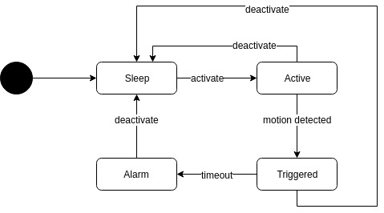

# IoT1 - Project

This application implements a distributed home surveillance system using MQTT. 

## Setup

### Using the dev setup

Each node is available as a docker container for easier development and testing. Start by running `docker-compose up`.

Start the controller:
```
docker-compose exec broker python controller.py 
```

Monitor traffic:
```
docker-compose exec broker python monitor.py 
```

Activate/deactivate surveillance system:
```
docker-compose exec toggleswitch touch VIRTUAL_BUTTON 
```

Trigger motion sensor:
```
docker-compose run motionsensor python motionsensor.py 
```

## Architecture

### State Diagram

The application uses a simple state machine to keep track of the state.


## Hardware

* 3x raspberry pi
* 1x button
* 1x camera
* 1x motiondetector

## TLS Configuration

*Please Note:* The keys and certificates found in this repository are only to be used in a test environment. 

### Setup

To generate the certificates, simply run the `tls/generate_tls_material.sh` script. 

#### Broker

Copy the server.crt and server.key to `/etc/mosquitto/certs` and the ca.crt to `/etc/mosquitto/ca_certificates`.

#### Client

Copy the ca.crt to `/etc/ssl/certs`.

## Project Deliverables

Presuming most laboratories are done in groups there will be an “abnahme” of about 10’ demonstration demonstrating an application-based awareness of system characteristics, including, but not necessarily limited to:

* Residence of application
* Relationship to time
* Relationship to location
* Discovery and identification
* Verification and validation
* Long term storage of data
* Error handling
* Lessons learned 
